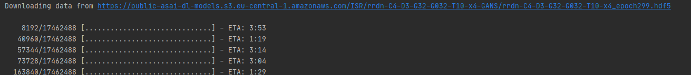
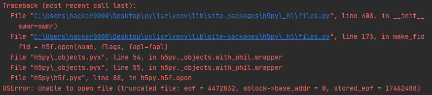
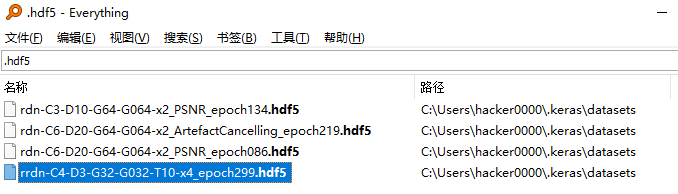
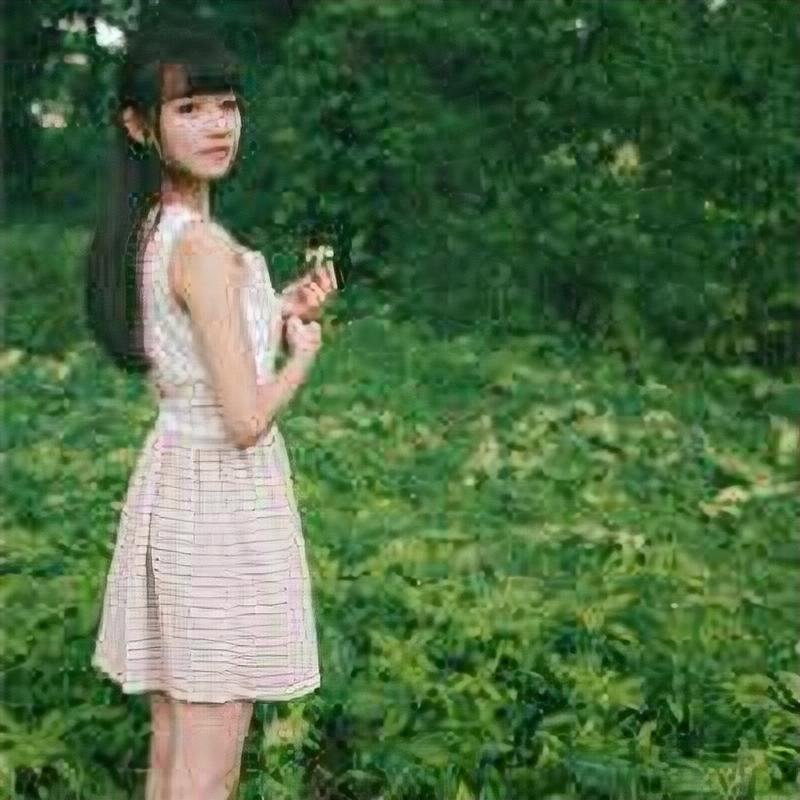

# ISR实现图片超分辨率

## 前言

最近笔者遇到一个图片超分辨率的需求，经过在网上一番搜寻后，发现一个项目比较符合要求，话不多说，一起来试试

## 介绍

项目GitHub地址：https://github.com/idealo/image-super-resolution

ISR全称是Image Super-Resolution（图片超分辨率）

该项目的目标是扩大和改善低分辨率图像的质量，其实现的网络包括了：

- The super-scaling Residual Dense Network described in [Residual Dense Network for Image Super-Resolution](https://arxiv.org/abs/1802.08797) (Zhang et al. 2018)
- The super-scaling Residual in Residual Dense Network described in [ESRGAN: Enhanced Super-Resolution Generative Adversarial Networks](https://arxiv.org/abs/1809.00219) (Wang et al. 2018)
- A multi-output version of the Keras VGG19 network for deep features extraction used in the perceptual loss
- A custom discriminator network based on the one described in [Photo-Realistic Single Image Super-Resolution Using a Generative Adversarial Network](https://arxiv.org/abs/1609.04802) (SRGANS, Ledig et al. 2017)

简单看下来呢，这个项目是一个高度封装的成品，甚至连训练好的模型都提供了

目前有如下4种模型：

- RDN: psnr-large, psnr-small, noise-cancel
- RRDN: gans

## 安装

安装方式有两种，从PyPI源用pip安装，或者从项目仓库直接拉取源码用setup.py安装

笔者选择了第一种方式

由于公司网络原因，本该顺利的安装过程还是遇到了不少坑

首先是因为ISR依赖TensorFlow的2.0.0版本，而TensorFlow 2又依赖Python 3.5–3.7

所以笔者先将自己本机的Python版本退回安装到了3.7.7版本

基础安装工作这里不详说了，请见笔者另一篇文章：Python、Pip、virtualenv的安装

我们开始按照ISR提示的步骤开始安装

这里切记注意网络原因导致的安装失败

```bash
pip install ISR
```

执行完后我们就可以建立一个Python项目来看下效果了

## 使用

第一步，我们引入RDN

```
from ISR.models import RDN

rdn = RDN(weights='psnr-small')
```

这一步后，ISR会去主动下载训练好的模型



如果在这一步出现网络抖动或者系统中断导致失败

你将会无限看到这个报错，别问笔者怎么知道的...



好了，那么如何解决这个问题呢？你需要移步`~\.keras\datasets`目录下

去删除这个下了一半的hdf5文件，然后在稳定的网络环境下，重新让它去下载模型即可



期间，看了不少issues来找到问题原因，偶然发现原先模型文件是ISR作者放在仓库内，需要以`git lfs pull`来获取到的，后来直接以代码来动态获取了

https://github.com/idealo/image-super-resolution/issues/21

继续第二步，我们需要输入一张图片，来获取到超分后的图片

```
import numpy as np
from PIL import Image

img = Image.open('data/input/test_images/sample_image.jpg')
lr_img = np.array(img)
sr_img = rdn.predict(lr_img)
img_out = Image.fromarray(sr_img)
img_out.save('/path/to/img_out.jpg')
```

做完以上步骤，你就能在`/path/to/`下发现生成好的`img_out.jpg`啦

## 进阶

我们之前只说了最基础的使用，也仅用到了`psnr-small`

当然我们还可以继续使用自己的数据集来训练这个模型，让实际效果更佳

体验下来最好的是`gans`，它能够快速地实现4倍的放大，效率也比其它3个模型要好

后续笔者会做些基准测试，来评判一下各个模型的优劣对比

## 附




此为网图，侵删。由`gans`生成，可以发现已提供的模型效果并不是特别通用，自己训练适合自己的模型还是非常必须的