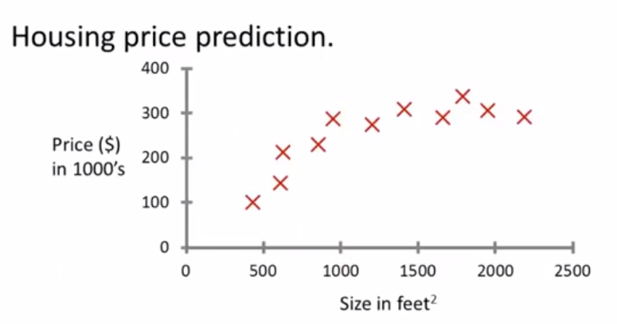
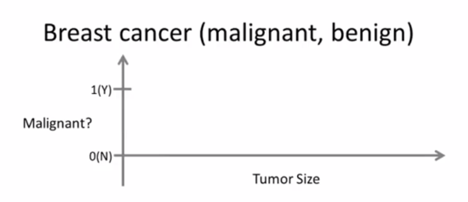

# 1. 绪论：初识机器学习

## 什么是机器学习

### Machine Learning Definition

Arthur Samuel (1959). Machine Learning: Field of study that gives computers the ability to learn without being explicitly programmed.

在没有明确设置的情况下，使计算机具有学习能力的研究领域

Tom Mitchell (1998) Well-posed Learning Problem: A computer program is said to learn from experience E with respect to some task T and some performance measure P, if its performance on T, as measured by P, improves with experience E.

计算机程序从经验E中学习解决某一任务T进行某一性能度量P，通过P测定在T上的表现因经验E而提高

## 监督学习

### 回归问题（regression problem）

x轴为房屋面积，y轴为房屋价格

### 分类问题（classification problem）

x轴为肿瘤大小，y轴为肿瘤是否恶性

## 无监督学习

### 聚类算法（clustering algorithm）

谷歌新闻：将相同主题的不同新闻聚集在一起

基因组学：检测一些物种是否有特定/相同基因

管理计算机集群：把做相似工作的计算机摆放在一起，使其能更高效地协同计算

社交网络的分析：根据联系频繁的人，找出同属一个圈子的朋友

市场细分：找出不同的市场分割，给细分市场中的客户进行精准营销

天文数据分析：星系形成理论

### 鸡尾酒会问题（cocktail party problem）

[W,s,v] = svd((repmat(sum(x.\*x,1),size(x,1),1).\*x)\*x')

在Octave中先建立机器学习算法原型，等这个算法可以工作后，再迁移到C++/Java或其它编译环境

