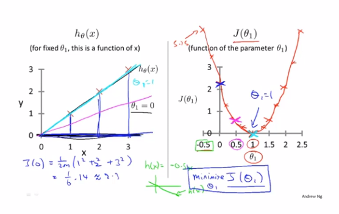
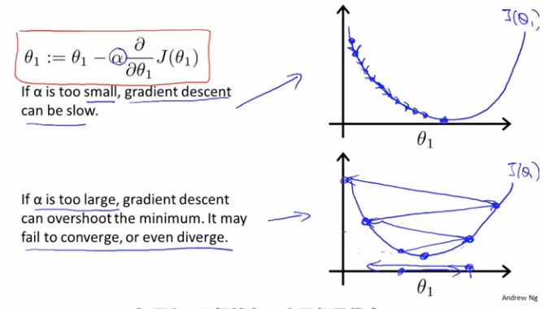
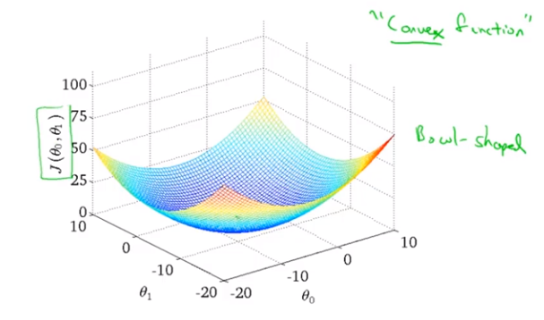

# 2. 单变量线性回归

## 模型描述


x轴为房屋面积，y轴为房屋售价，我们现在需要根据这些数据来预测当我们有个1250平方英尺的房子能卖多少钱？

我们可以做模型拟合，大致得出售价约为220000美元左右

这是一个监督学习算法的例子，因为每一个例子都有一个正确答案

这还是一个回归问题（regression problem）


训练集（training set）：m表示训练样本的数量，x表示输入变量，y表示要输出变量

`(x, y) `表示一个训练样本

`(x^(i), y^(i))`表示第i个训练样本（i从1开始）


我们向学习算法提供一个训练集，学习算法的任务是输出一个假设函数h（hypothesis），h的作用是通过x来预测y

```
h_θ(x)=θ_0+θ_1*x
```

线性回归（linear regression） 

一元线性回归（linear regression with one variable）

单变量线性回归（univariate linear regression）

## 代价函数


关键是如何选取`θ_0`和`θ_1`


我们要做的就是得出`θ_0`和`θ_1`这两个参数的值，让假设函数表示的直线，尽量地与这些数据点很好的拟合

那么我们就要使`h(x)`也就是输入x时我们预测的值y最接近该样本对应的y值，这样的`θ_0`和`θ_1`就是我们需要的

所以我们要解决的是一个最小化问题（minimization problem）

简单来说，我们把这个问题变成了：

找到能使训练集中预测值和真实值的差的平方的和的1/2m最小的`θ_0`和`θ_1`的值

（取1/2m而不是1/m的原因是，后面求偏导数的时候能和平方的倒数抵消，方便计算）


代价函数（cost function）也叫平方误差函数（squared error function），或平方误差代价函数（squared error cost function）

平方误差函数对于大多数问题，特别是回归问题，都是一个合理的选择，可能也是最常用手段

## 代价函数（一）




我们先简化假设函数，令`θ_0`等于0，即`h_θ(x)=θ_1*x`，给定训练集`[(1,1),(2,2),(3,3)]`，想用代价函数`J(θ_1)`求出最小`θ_1`。通过对`θ_1`的不同取值，我们可以根据训练集得到不同的的`J(θ_1)`值，得到其图像最低点`(1,0)`，即可以找到我们需要的最小`θ_1`，即为`1`，最后代回我们的`h_θ(x)=θ_1*x`，可得`h_θ(x)=x`，就是我们最终拟合的结果假设函数了

## 代价函数（二）


假设函数、参数、代价函数、目标


当我们有2个参数`θ_0`、`θ_1`的时候，代价函数`J(θ)`的图像就会是个3D的碗状图形

等高线图（contour plots）或等高图像（contour figures）


右图中每个圈代表的是`J(θ_0,θ_1)`值相等的点


越靠近圆心的点所对应的点`(θ_0,θ_1)`能更好地确定假设函数`h_θ(x)`来拟合当前训练集的点分布情况

## 梯度下降

梯度下降是很常用的算法，它不仅被用在线性回归上，还被广泛应用于机器学习的众多领域


不同的初始值`(θ_0,θ_1)`设定，有可能让梯度下降找到并不相同的局部最优点


这里需要注意的是，`θ_0`，`θ_1`需要做到同步更新

## 梯度下降知识点总结


式中`α`为学习速率，`α`后面的项为代价函数`J(θ_1)`在`θ_1`方向上的偏导数，也可以看成斜率

如果当`θ_1`取值在最低点的右侧，`J(θ_1)`在该点偏导数为正数，新的`θ_1`必减小（靠近最低点）

如果当`θ_1`取值在最低点的左侧，`J(θ_1)`在该点偏导数为负数，新的`θ_1`必增大（靠近最低点）

所以`θ_1`值最终都会收敛



当然，如果学习速率`α`取值过大，就会发现`θ_1`值无法收敛甚至发散

那么，如果`θ_1`已经在一个局部最优点，下一步梯度下降会怎么样？


该点偏导数为0，`θ_1`将不会再被更新


此外，当我们越接近局部最优点时，偏导数会越来越小，每次`θ_1`减去的值也会越来越少，所以我们没有必要去减小学习速率`α`了

## 线性回归的梯度下降


这里需要令`h_θ(x^(i))-y^(i)=t`，用链式法则可解




大部分情况下，都为凸函数（convex function）或弓形函数（bow-shaped function）


有时候称此算法为Batch梯度下降（"Batch" gradient descent）

意味着每一步梯度下降，都遍历了整个训练集的样本

正规方程组方法（normal equations methods）

