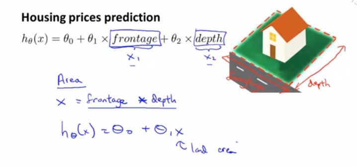

# 5. 多变量线性回归

## 多功能

在之前的例子中，我们使用房屋的面积来预测价格


但是我们现在有更多数据，比如：面积/卧室数/楼层数/年龄

现有如下定义：

- `n`表示特征的数量

- `x^(i)`表示训练集里边第`i`个样本，它是一个`n`维向量

- `x^(i)_j`表示训练集里第`i`个样本中的第`j`个特征量


之前的简单假设函数只有1个特征值，也就是房屋面积

之后的会有4个或更多特征值


我们现在可以把式子简化表达成2个矩阵的乘积形式

```
h_θ(x)=θ_0+θ_1*x_1+θ_2*x_2+...+θ_n*x_n
      =θ^T*x
```


## 多元梯度下降法

当我们把参数用矩阵/向量的形式表达后，我们可以把代价函数简化如下


回顾之前第2章讲的梯度下降算法的求偏导的结论可得如下式子


## 多元梯度下降法演练1：特征缩放

当我们在做梯度下降的时候，有多个特征，我们应该尽量确保这些特征都处于一个相近的范围内，这样梯度下降法能更快地收敛

假设我们有2个特征，`x_1`为房屋面积（0-2000平方英尺），`x_2`为卧室数量（1-5个），当我们画出代价函数`J(θ)`等值线图像，会发现图像是个非常扁长的椭圆，因为2个特征的取值范围相差过大，当我们运行梯度下降算法的时候，可能会来回波动并花很长一段时间才能最终收敛到全局最小值

那么这种情况下，我们可以采用特征缩放的方式来优化

我们令`x_1`为原值的`1/2000`，`x_2`为原值的`1/5`，这样的好处是可以使2个特征值都处于`[0,1]`区间内，等值线图像更近似一个正圆，代价函数可以更快地找到全局最小值


尽量确保特征值缩放在`[-1,1]`区间内，只要差别不是特别大都可以接受


我们也可以对特征值做平均归一化，令`x_1=(x_1-μ_1)/s_1`，其中`μ_1`为样本中平均值，`s_1`为变量的标准差，其实也可以用样本中最大值与最小值的差值作为`s_1`


## 多元梯度下降法演练2：学习率

下面讲一些小技巧来确定梯度下降是正常工作的

以及如何选择学习率`α`


梯度下降算法做的事情就是找到一个`θ`值，并且希望它能够最小化代价函数`J(θ)`

所以我们可以在梯度下降算法运行时，绘出代价函数`J(θ)`的值和梯度下降算法迭代次数的图像，如果算法正常工作的话，每一步迭代之后`J(θ)`都应该下降，我们可以从图像看出在300步之后，曲线看起来就非常平坦了，算法差不多已经收敛了，因为代价函数没法再继续下降更多了

对于不同问题，梯度下降算法所需的迭代次数可能相差会很大，某些可能只需要30步就可以收敛，其它需要可能300甚至300w步

另外，也可以进行一些自动的收敛测试，如果代价函数`J(θ)`一步迭代后的下降小于一个很小的值`ε`，这个测试就判断函数已经收敛，`ε`可以是`1e-3`，但是通常来说，选取一个合适的`ε`是非常困难的，所以还是倾向于查看图像来判断函数是否收敛


如果我们发现代价函数`J(θ)`随着迭代次数增大或者波动，说明我们需要选取更小的学习率`α`，但如果选取过小的`α`，也会导致梯度下降算法过慢收敛


一般会按增大3倍来选取`α`


## 特征和多项式回归

假设我们需要预测房屋价格，有2个特征值，`frontage`是房屋临街宽度，`depth`是房屋垂直宽度，但我们并不一定要用给出的数据列作为特征，可以自己创造新的特征，比如房屋面积`area=frontage*depth`，有时这样可以得到一个更好的模型



多项式回归（polynomial regression）

当我们要对一些点做拟合的时候，有时3次函数会比2次函数更合适，因为2次函数图像在本例中最终会下降，但显然房屋价格并不会这样

而使用3次函数做拟合的话，特征缩放就非常重要了，如果房屋面积`x`范围在`1-10^3`平方英尺，那么`x^2`范围就在`1-10^6`平方英尺，而`x^3`范围在`1-10^9`平方英尺了


我们甚至可以选用开根号函数来拟合


之后将探讨一些算法，它们能够自动选择要使用什么特征

## 正规方程（区别于迭代方法的直接解法）

目前为止，我们一直在使用的线性回归算法是梯度下降算法，为了最小化代价函数`J(θ)`，我们需要很多步迭代，才能收敛到全局最小值

而正规方程（normal equation）提供了一种求`θ`的解析解法，不需要迭代，可以直接一次性求解`θ`的最优值


我们先假设有个非常简单的代价函数`J(θ)`，它是个关于`θ`的二次函数，我们可以用微积分对`J(θ)`求导，并让它的导函数值为0，那么此时满足条件的参数横坐标值即为`J(θ)`最小值横坐标取值

以上是`θ`为实数的一个简单情况，而`θ`在其它情况下是一个n+1维的参数向量，那我们该如何最小化代价函数`J(θ)`呢，微积分告诉我们可以逐个对参数`θ_j`求`j`的偏导数，然后把它们全部置零，这样求出所有的`θ_0`，`θ_1`一直到`θ_n`，就能够得到最小化代价函数`J(θ)`的各个`θ`值了


我们接下来看一个样本数量m=4的训练数据集

