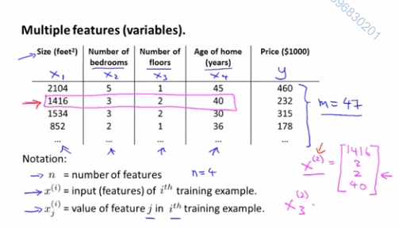
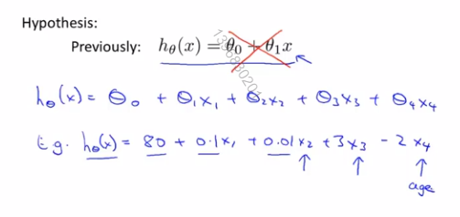

# 5. 多变量线性回归

## 多功能

在之前的例子中，我们使用房屋的面积来预测价格

但是我们现在有更多数据，比如：面积/卧室数/楼层数/年龄

现有如下定义：

- `n`表示特征的数量

- `x^(i)`表示训练集里边第`i`个样本，它是一个`n`维向量

- `x^(i)_j`表示训练集里第`i`个样本中的第`j`个特征量

之前的简单假设函数只有1个特征值，也就是房屋面积

之后的会有4个或更多特征值

