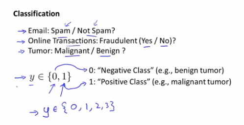
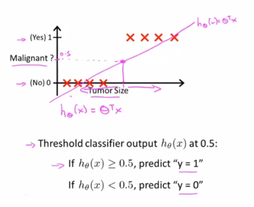
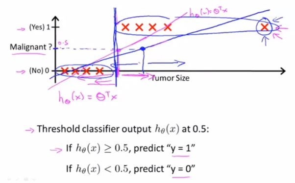
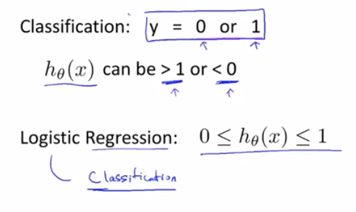

# 7. Logistics回归

## 分类

分类问题

- 电子邮件：是否垃圾邮件？
- 网上交易：是否欺诈交易？
- 肿瘤分类：是否良性/恶性？

分类可以二元分类，或者多分类，我们先从简单的negative/positive开始

如果我们尝试用线性回归来处理肿瘤的分类问题，用直线去拟合它，然后定义阈值为0.5，当`h_θ(x)`>=0.5，预测`y`为1；当`h_θ(x)`<0.5，预测`y`为0。

这样看上去这个算法能完美预测，但是当我们尝试新加个样本数据

就会发现这个额外的样本数据，改变了原先拟合的直线，让原本恶性的样本被归类成良性了，所以把线性回归算法用于分类问题，并不是个好主意

将线性回归算法引入分类问题，还会导致预测值和预期的分类输出不一致

所以我们将使用logistics回归算法来处理分类问题

## 假设陈述

