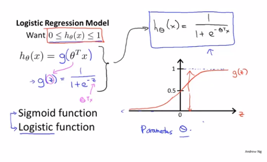
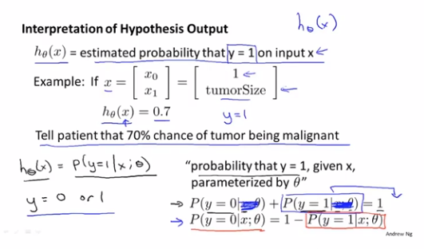
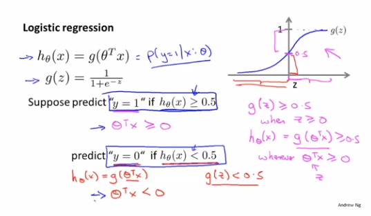
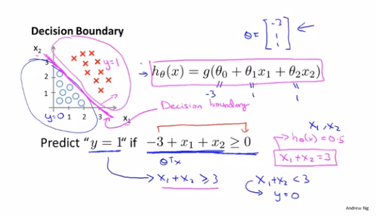
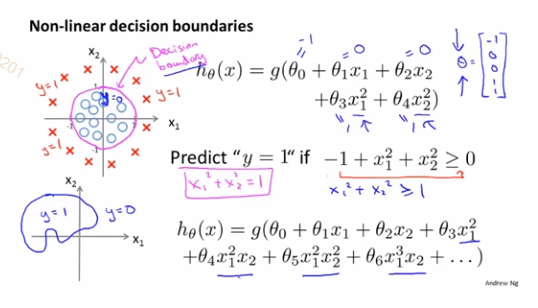

# 7. Logistics回归

## 分类

分类问题

- 电子邮件：是否垃圾邮件？
- 网上交易：是否欺诈交易？
- 肿瘤分类：是否良性/恶性？

分类可以二元分类，或者多分类，我们先从简单的negative/positive开始

如果我们尝试用线性回归来处理肿瘤的分类问题，用直线去拟合它，然后定义阈值为0.5，当`h_θ(x)`>=0.5，预测`y`为1；当`h_θ(x)`<0.5，预测`y`为0。

这样看上去这个算法能完美预测，但是当我们尝试新加个样本数据

就会发现这个额外的样本数据，改变了原先拟合的直线，让原本恶性的样本被归类成良性了，所以把线性回归算法用于分类问题，并不是个好主意

将线性回归算法引入分类问题，还会导致预测值和预期的分类输出不一致

所以我们将使用logistics回归算法来处理分类问题

## 假设表述

我们的假设函数是`h_θ(x)=θ^T*x`，现在希望分类器的输出值在`[0,1]`区间，我们可以令`g(z)=1/(1+e^(-z))`，`g(z)`可被称为`sigmoid`函数或`logistics`函数，可以看出`g(z)`的图像在原点左侧无限趋近于0，而在原点右侧无限趋近于1，那么我们将`h_θ(x)`作为参数代入`g(z)`可得`h_θ(x)=1/(1+e^(-θ^T*x))`，这样就可以确保原先`h_θ(x)`的输出分布在`[0,1]`区间了

现在我们可以通过`h_θ(x)`来计算出y=1的概率，且由于y只能取0或1，所以y=0的概率+y=1的概率=1

## 决策界限

有了`g(z)`我们就可以将`h_θ(x)`输出假设定为0或1了

`if h_θ(x) < 0.5 ? 0 : 1`

一个简单例子，`x1+x2>=3`的图像就是决策边界，在直线上方的点都被预测为`y=1`，下方反之

同上，只要我们计算出了`θ`，就能得出决策界限，而并不依赖图中根据训练集画出来的图像

复杂的假设函数能够更好地拟合决策边界图像

## 代价函数

